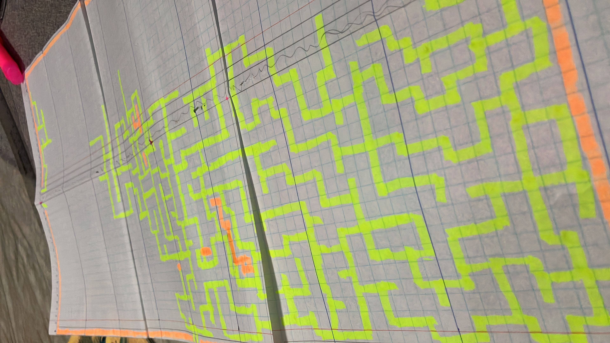

# Pathfinding Algorithm Visualizer

This project is a Python-based visualizer for different pathfinding algorithms such as A*, Backtracking, and Dijkstra. The grid-based maze used in this program was hand-drawn and manually transcribed into a grid format.

## Table of Contents

- [Features](#features)
- [Hand-Drawn Maze](#hand-drawn-maze)
- [Installation](#installation)
- [Running the Program](#running-the-program)
- [Pathfinding Algorithms](#pathfinding-algorithms)
- [How the Maze Was Created](#how-the-maze-was-created)
- [Contributing](#contributing)

## Features

- Visualize pathfinding algorithms: A*, Backtracking, and Dijkstra
- Step-by-step visualization of the algorithms working through the grid
- Easy-to-use menu system to select algorithms
- Hand-drawn maze, transcribed into a grid format

## Hand-Drawn Maze

The maze used in this program was originally hand-drawn on graph paper and then manually transcribed into a 2D grid array. Each cell in the grid represents either a wall or an open space. This grid serves as the environment where the pathfinding algorithms operate.

The maze is stored in `grids/hardcoded_grid.py`, where each `1` represents a wall, and each `0` represents a walkable path.

## Installation

Follow these steps to set up the project on your local machine.

### Prerequisites

- **Python 3.x**: Ensure you have Python 3.x installed. If not, download and install Python from [here](https://www.python.org/downloads/).

### Linux/macOS (Shell Script)

1. Clone the repository:
   ```bash
   git clone https://github.com/azharxkhan/pathfinding-visualizer.git
   cd pathfinding-visualizer
   ```

2. Run the setup script:
   ```bash
   chmod +x setup_and_run.sh
   ./setup_and_run.sh
   ```

This will create a virtual environment, install the necessary dependencies (including `pygame`), and run the program.

### Windows (Batch Script)

1. Clone the repository:
   ```batch
   git clone https://github.com/azharxkhan/pathfinding-visualizer.git
   cd pathfinding-visualizer
   ```

2. Run the `setup_and_run.bat` file by double-clicking it or running the following command:
   ```batch
   setup_and_run.bat
   ```

This will create a virtual environment, install `pygame`, and launch the program.

## Running the Program

Once the installation is complete, the program will launch, and you'll see a menu where you can select one of the following options:

- Run A* Algorithm
- Run Backtracking Algorithm
- Run Dijkstra Algorithm
- Exit

Use the arrow keys to navigate the menu and press `Enter` to select an option.

After selecting an algorithm, the program will display the maze, and the chosen algorithm will begin solving it step by step.

## Pathfinding Algorithms

### A* Algorithm
- A popular algorithm that finds the shortest path between two points using both the actual distance traveled and an estimated distance to the end.

### Backtracking Algorithm
- A brute-force approach that tries all possible paths to find a solution. It may not be the most efficient but guarantees a solution if one exists.

### Dijkstra Algorithm
- Finds the shortest path from the start to all other points in the grid. Unlike A*, it doesn’t use heuristics, so it explores more paths.

## How the Maze Was Created

The maze was originally hand-drawn on graph paper, and the drawing was then translated into a grid format where:
- `1` represents a wall or obstacle.
- `0` represents a walkable path.

The hand-drawn maze was manually transcribed into the Python program in the form of a 2D list, stored in the file `grids/hardcoded_grid.py`. Each row and column of the list corresponds to the grid cells in the maze.

### Steps in Maze Creation

#### Step 1: Creating Walls


#### Step 2: Filling in Walls


#### Step 3: Finalizing the Maze Layout


This grid is visualized on the screen, and the pathfinding algorithms operate on it to find a path from the start to the end.

## Contributing

If you'd like to contribute to this project:
1. Fork the repository.
2. Create a new branch: `git checkout -b feature/your-feature`.
3. Commit your changes: `git commit -m 'Add some feature'`.
4. Push to the branch: `git push origin feature/your-feature`.
5. Open a pull request.

Feel free to report issues or suggest improvements.


